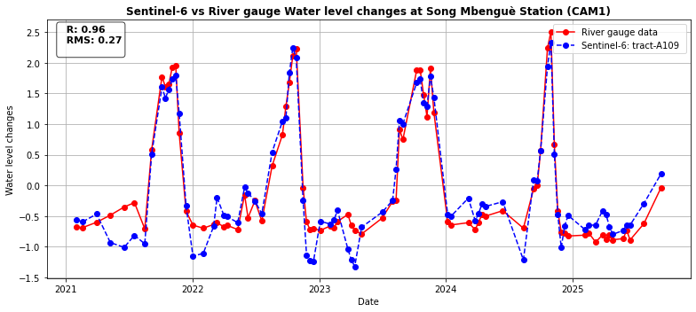

# Altimetry Validation Workflow (CAMEO-WAGST)

## Project Overview

The second line of work within the CAMEO-WAGST project focuses on deriving water levels from satellite altimetry at RPR stations in order to validate Sentinel-3 and Sentinel-6 measurements.

This repository implements a complete altimetry validation workflow for processing satellite-derived water surface heights (SSH) from Sentinel-3A, Sentinel-3B, and Sentinel-6 missions.

## Data Sources

This validation workflow relies on satellite altimetry products generated using the Fully-Focused SAR (FFSAR) processing chain. The FFSAR preprocessing (developed in the *Altimetry_FFSAR* module) includes:
- Omega-Kappa SAR focusing  
- Waveform retracking using SAMOSA+  
- Signal enhancement for inland and coastal waters  

The preprocessing workflow is available here [[Altimetry_FFSAR](../*Altimetry_FFSAR*)](https://github.com/chenjm-1996/JMART_Processer)

This repository uses the resulting Level-2 FFSAR products as input for validation and analysis.

The satellite products are rigorously validated against independent ground-based observations:

- GNSS-IR measurements from RPR stations: the processed GNSS-IR data, as described in the ../*RPR_processing* module, are used in this study for validation purposes. 
- In-situ hydrometric gauge data
- water level time series from the DAHITI database (DGFI-TUM)('https://dahiti.dgfi.tum.de/en/map/')

## Workflow Description

The workflow is demonstrated using a representative RPR station and corresponding in-situ hydrometric data, serving as a reference implementation of the full processing chain.

It includes:
- Extraction of SSH time series from satellite altimetry  
- Spatial filtering over river and coastal systems  
- Geophysical corrections and slope adjustments  
- Robust statistical aggregation (median + MAD)  
- Cross-validation with ground-based observations  

## Objectives

The main objective is to generate high-quality SSH time series over river and coastal environments, enabling:

- Accurate comparison with in-situ measurements  
- Cross-validation between independent techniques  
- Improved monitoring of hydrological dynamics  

## Scientific Impact

This approach supports the development of robust multi-source water level monitoring systems by integrating:

- Satellite altimetry (Sentinel missions)  
- GNSS-IR observations  
- Conventional hydrometric gauges  

This integration improves the reliability, spatial coverage, and consistency of hydrological observations.

## Example of Altimetry Validation Result

The figure below shows a comparison between Sentinel-6 satellite-derived water surface heights (SSH) and in-situ river gauge measurements at the Song Mbenguè station (CAM1).

  
   

