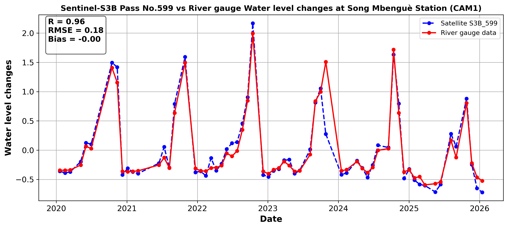
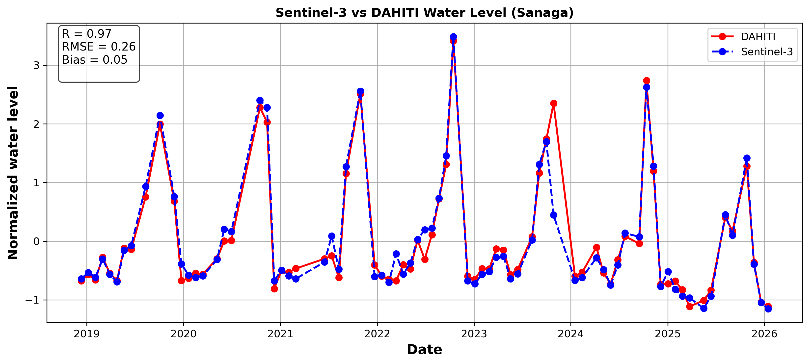

# Altimetry Validation Workflow (CAMEO-WAGST)

## Project Overview

The second line of work within the CAMEO-WAGST project focuses on deriving water levels from satellite altimetry at RPR stations in order to validate Sentinel-3 and Sentinel-6 measurements.

This repository implements a complete altimetry validation workflow for processing satellite-derived water surface heights (SSH) from Sentinel-3A, Sentinel-3B, and Sentinel-6 missions.

## Data Sources

This validation workflow relies on satellite altimetry products generated using the Fully-Focused SAR (FFSAR) processing chain. The FFSAR preprocessing (developed in the *Altimetry_FFSAR* module) includes:
- Omega-Kappa SAR focusing  
- Waveform retracking using SAMOSA+  
- Signal enhancement for inland and coastal waters  

The preprocessing workflow is available here: [Altimetry_FFSAR](https://github.com/chenjm-1996/JMART_Processer)

This repository uses the resulting Level-2 FFSAR products as input for validation and analysis.

The satellite products are rigorously validated against independent ground-based observations:

- ### *GNSS-IR measurements from RPR stations*
The processed GNSS-IR data, following the GNSS-IR processing workflow described in the *RPR_processing* module, are used in this study. The full processing chain is available here: [RPR_processing](https://github.com/MakanAKaregar/CAMEO_WGAST/tree/4d6a2514814fc5e725057033ca62d3d0c32899bf/RPR_processing)
- ### *In-situ hydrometric gauge data* 
The in-situ hydrometric gauge data are obtained from AES-SONEL (Energy Corporation of Cameroon) at the CAM1 station (Song Mbenguè). Water levels are recorded through manual staff gauge readings (limnimetric scales) performed four times per day at 07:00, 12:00, 17:00, and 22:00. This manual observation procedure may introduce measurement uncertainties due to operator-dependent reading accuracy.

  
   

- ### *water level time series* from existing virtual gauges in the DAHITI database (DGFI-TUM):
These data are accessed and downloaded through the official portal: https://dahiti.dgfi.tum.de/en/map/.
Further the ground-based observations,other ancillary data are used:
- ### *SWORD dataset*
The SWORD database is used for the river slope correction and publicly available here: https://www.swordexplorer.com/. The slope correction applied in this study follows the methodology described in: https://doi.org/10.1016/j.jhydrol.2024.132553.
- ### *River mask* 
The river mask, provided by the National Institute of Cartography (Cameroon), is used for spatial filtering. It allows the isolation of valid river pixels and the removal of non-water or out-of-basin observations within the Sanaga basin, ensuring that only measurements located within the hydrological domain of interest are retained.

## Workflow Description

The workflow is demonstrated using a representative RPR station or corresponding in-situ hydrometric data, serving as a reference implementation of the full processing chain.

It includes:
- Read Sentinel-3&6 altimetry data
- Select measurements around target stations
- Spatial filtering over river and coastal systems
- Extraction of SSH time series from satellite altimetry
- Geophysical corrections and slope adjustments(for river applications)
- Robust statistical aggregation (median + MAD)
- Cross-validation with ground-based observations  

## Objectives

The main objective is to generate high-quality SSH time series over river and coastal environments, enabling:

- Accurate comparison with in-situ measurements  
- Cross-validation between independent techniques  
- Improved monitoring of hydrological dynamics  

## Scientific Impact

This approach supports the development of robust multi-source water level monitoring systems by integrating:

- Satellite altimetry (Sentinel missions)  
- GNSS-IR observations  
- Conventional hydrometric gauges  

This integration improves the reliability, spatial coverage, and consistency of hydrological observations.

## Examples of altimetry validation result

The figures below show the examples of the comparison between Sentinel-3 satellite-derived water surface heights (SSH) and in-situ river gauge and DAHITI measurements at the Song Mbenguè station (CAM1).

    
 
    
 
