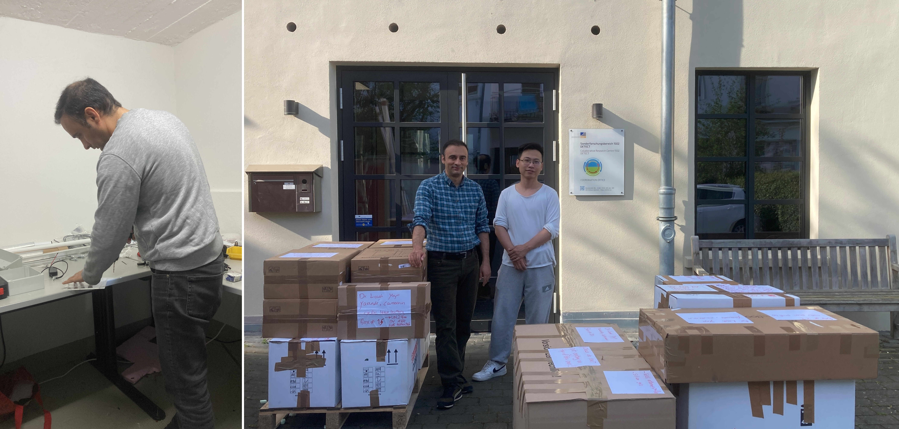
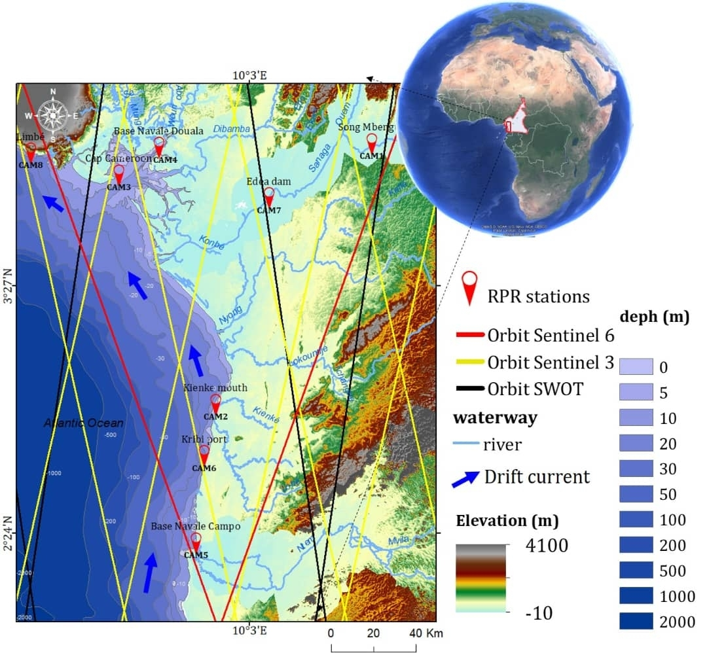
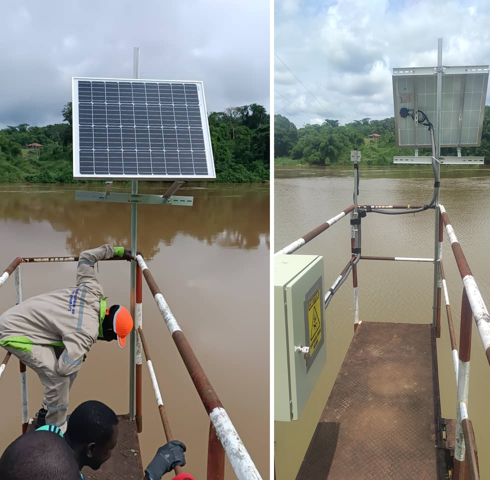
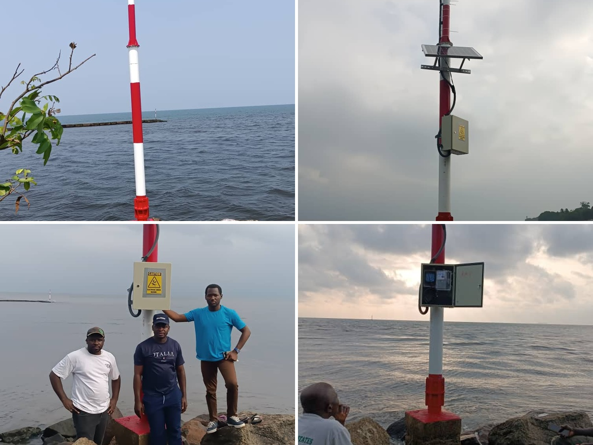
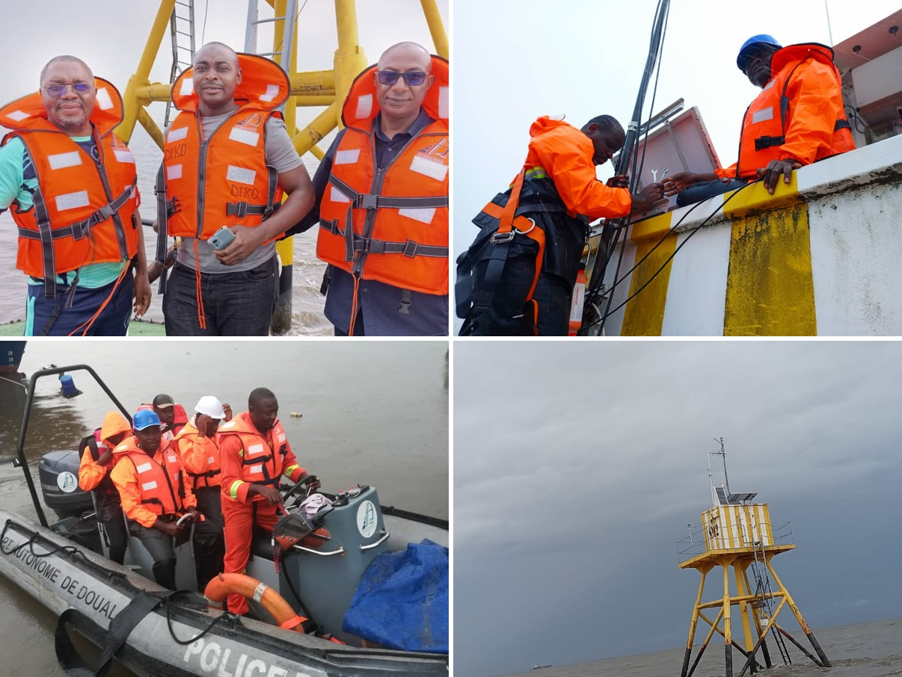
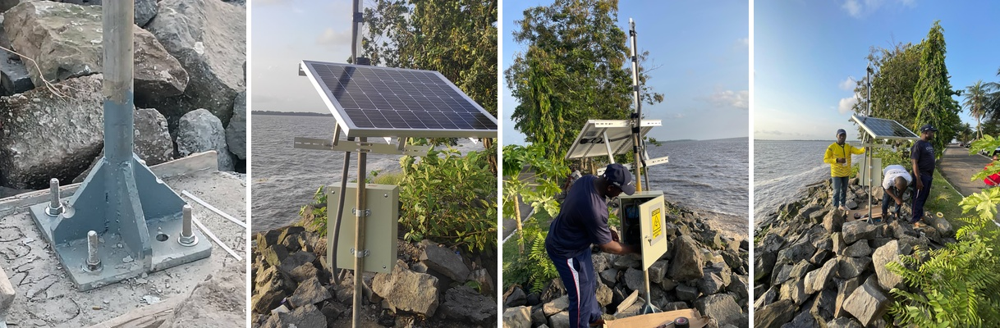
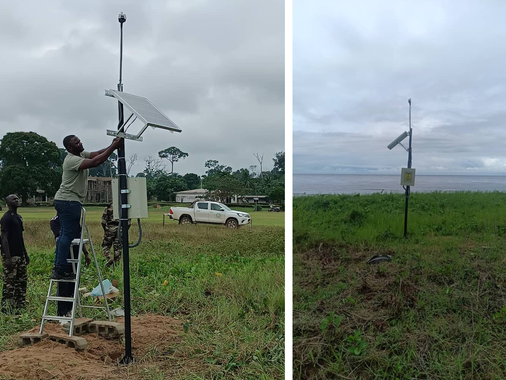
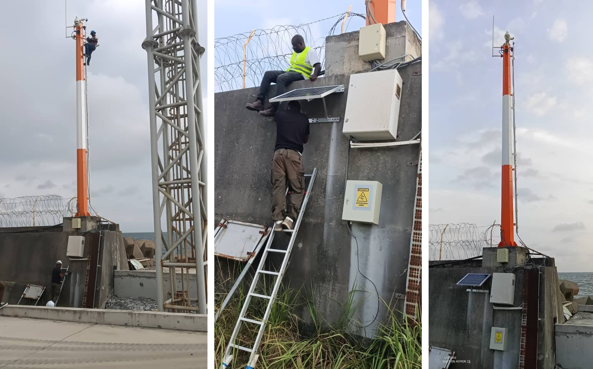
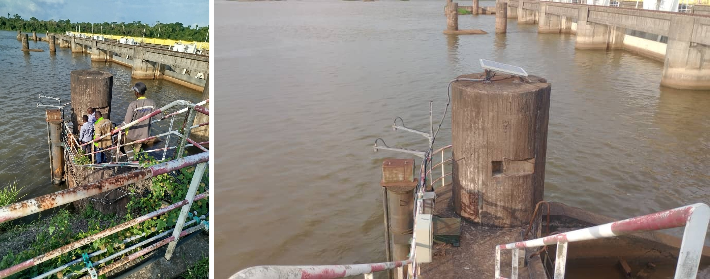
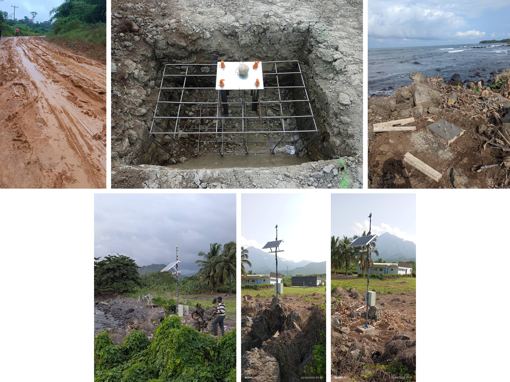

This folder documents the field campaign carried out in Cameroon between May and June 2025 as part of the [ESA-funded CAMEO-WAGST project](https://github.com/MakanAKaregar/CAMEO_WGAST), a collaboration between the Institute of Geodesy and Geoinformation at the University of Bonn, Germany, and the National Institute of Cartography in Cameroon. It covers the preparation, logistics and deployment of eight [Raspberry Pi Reflector (RPR)](https://agupubs.onlinelibrary.wiley.com/doi/full/10.1029/2021WR031713) stations across a range of hydrodynamic environments, including the Sanaga River, coastal sites, estuaries and port facilities.

RPR assembly in the DETECT project lab [(SFB 1502)](https://sfb1502.de/) at the University of Bonn. Around 300 kg of equipment including solar panels, lead-acid batteries, enclosure boxes, GNSS receivers and antennas, steel profiles and installation tools, was prepared and shipped to Cameroon.

  
   

Eight RPR GNSS-IR sensors were deployed across a range of hydrodynamic environments in Cameroon between May and June 2025. 

Two stations were installed along the Sanaga River: 

CAM7 adjacent to Edea hydropower dam, CAM1 near a planned dam.

Six stations covered the coastline: 

CAM4 (Wouri estuary), CAM5 (Campo-Ntem) estuary, CAM2 (near the coastal city of Kribi), CAM8 (near the coastal city of Limbe), CAM6 (within the port of Kribi)

  
   
  <em>Figure 1. Location of the eight RPR stations along the Cameroonian coast and the Sanaga River in the Gulf of Guinea. The red, yellow and black lines indicate the ground tracks of Sentinel-6, Sentinel-3, and SWOT, respectively.</em>

### Site CAM1 is is near a planned major hydropower dam, about 72 km upstream along the Sanaga River

  
   
  <em>.</em>

### Site CAM2 is near the coastal cities of Kribi. Kribi hosts one of Cameroon’s main deep-sea ports and is influenced by port operations and coastal development.

  
   
  <em>.</em>

### Site CAM3 is in 

  
   
  <em>.</em>

### Site CAM4 is in the Wouri estuary near the large city of Douala, a wide tidal estuary with convergence of multiple rivers and channels.

  
   
  <em>.</em>

### Site CAM5 is in the Campo (Ntem) River estuary, a narrow estuary with forested banks dominated by a single river

  
   
  <em>.</em>

### Site CAM6 is installed within the port of Kribi, a major commercial harbor along the Cameroonian coast.

  
   
  <em>.</em>

### Site CAM7 is next to the Edea Dam, a major hydropower facility regulating river discharge

  
   
  <em>.</em>

### Site CAM8 is in Limbe, along a volcanic coastline with complex near-shore bathymetry and energetic wave conditions

  
   
  <em>.</em>

