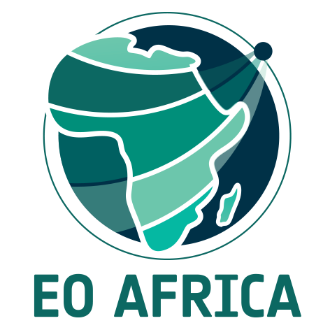

  

# CAMEO-WAGST

**Cameroon Advanced Measurements for Enhanced Observations of Water Levels using Affordable GNSS-IR and Sentinel-3 & Sentinel-6 Technology**

🔗 Project page (EO AFRICA R&D Facility):  
https://www.eoafrica-rd.org/research/research-projects-2024-2026/#proposal_8

Poject PIs: [Makan Karegar (University of Bonn)](https://www.igg.uni-bonn.de/apmg/de/team/staff/karegar), Loudi Yap (NIC)

---

## Overview

This repository hosts the end-to-end processing workflow developed within the CAMEO-WAGST project.  
The goal of the project is to establish Africa’s first GNSS-IR–based water level monitoring network and to use it for the validation of Sentinel-3A/B and Sentinel-6 satellite altimetry over rivers, estuaries, and coastal zones in Cameroon.

The workflow integrates:

- Low-cost GNSS-IR water level monitoring using the 
  Raspberry Pi Reflector (RPR) network
- Satellite altimetry processing for Sentinel-3 and Sentinel-6  
  (including FFSAR focusing and retracking)
- Validation and performance assessment of satellite-derived water levels  
  against GNSS-IR (RPR) observations and available in-situ river gauges

The repository is designed to support reproducible research, open-source development and scalable deployment in data-sparse regions.

---

## Key Objectives

- Deploy and operate low-cost GNSS-IR sensors for continuous water level monitoring
- Quantify the performance and limitations of Sentinel-3 and Sentinel-6 in
  tropical riverine and coastal environments
- Provide independent in-situ reference data for satellite altimetry validation
- Support flood monitoring and early-warning applications in Cameroon and beyond
- Enable scalable adoption across Africa and other developing regions**

---

## Repository Scope

This repository covers the full processing chain:

1. GNSS-IR data acquisition and processing (Raspberry Pi Reflector)
2. Sentinel-3 / Sentinel-6 altimetry processing
3. Spatio-temporal collocation and validation
4. Statistical analysis and visualization for scientific publications

Each component can be used independently or as part of a complete pipeline.

---

## Citation

If you use this repository or derived products, please cite:

> Establishing Africa’s first GNSS-IR network for coastal and river water level monitoring and satellite altimetry validation (WRR)

---

## License

This project follows an open-source philosophy.  
License information will be provided in the `LICENSE` file.

---

## Contact

**Project Leads**
- University of Bonn (Germany): Makan Karegar (karegar@uni-bonn.de), Jiaming Chen (jchen1@uni-bonn.de)  
- National Institute of Cartography (Cameroon): Loudi Yap (loudiyap@yahoo.fr) 
