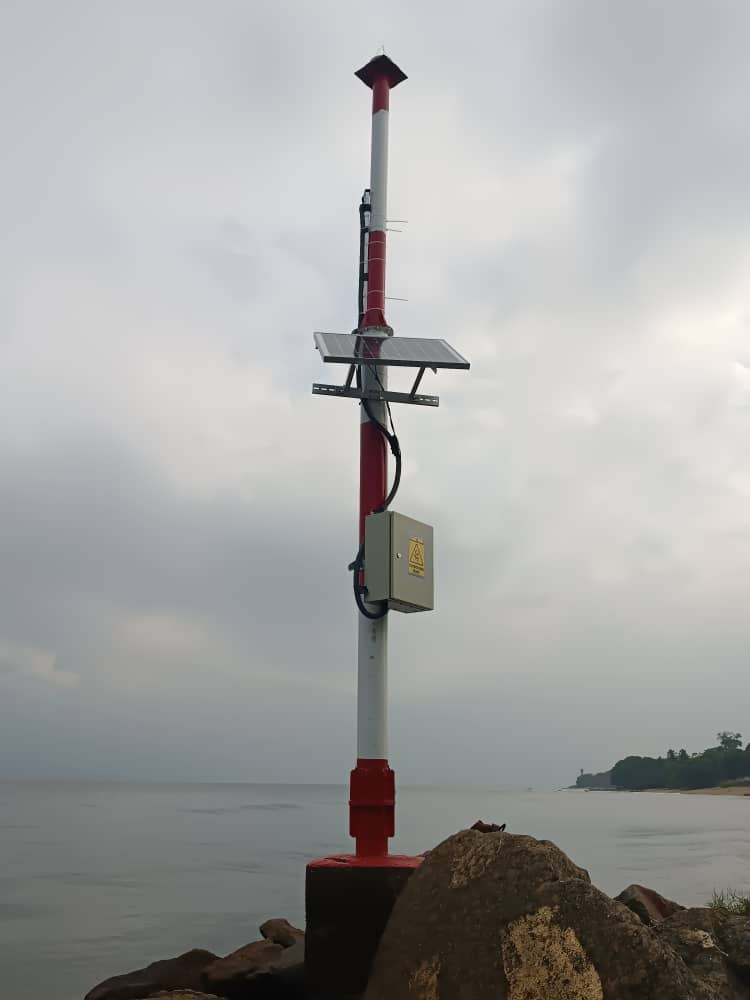
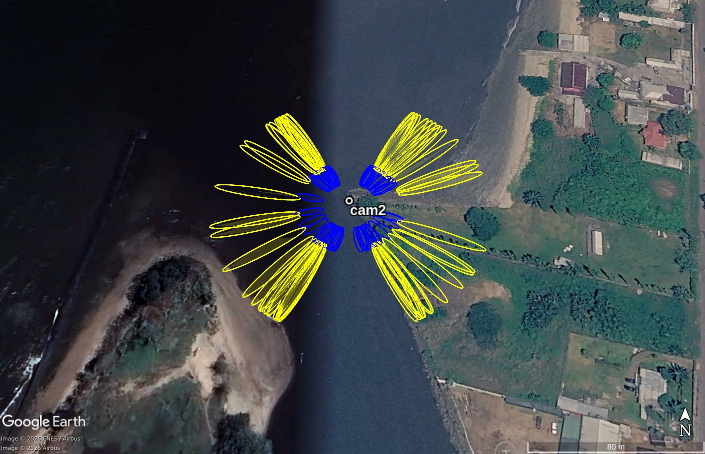
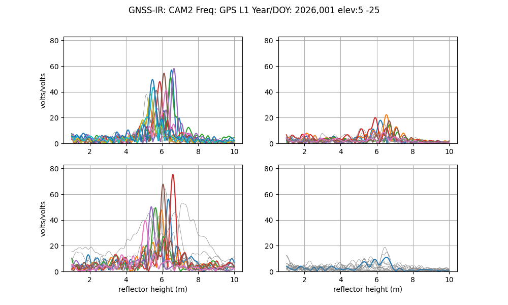
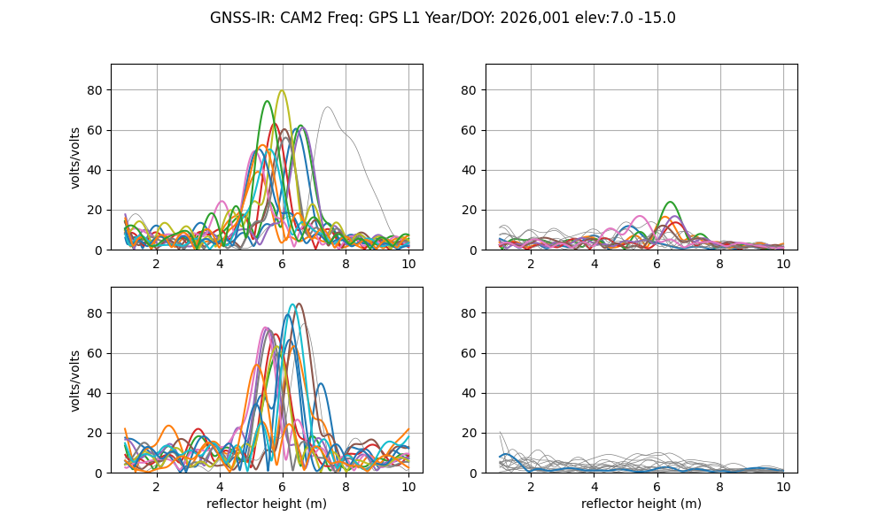

In the CAMEO-WGAST project, eight RPRs were installed in summer 2025. The workflow below presents a use case for one of the RPRs installed.

# RPR Processing

This directory contains GNSS-IR processing workflows and post-processing using [gnssrefl](https://gnssrefl.readthedocs.io/en/latest/) used in the CAMEO-WAGST project.

It focuses on:
- GNSS-IR reflector height estimation
- Water level time series generation
- Quality control and filtering
- Formatting outputs for satellite validation

# Kiribi, Camroon

The data collected here is from a [Raspberry Pi Reflector](https://agupubs.onlinelibrary.wiley.com/doi/full/10.1029/2021WR031713). Detailed instructions for RPR setup are provided [here.](https://github.com/MakanAKaregar/RPR/tree/v2.0.0)

Station cam2 is located in the coastal city of Kribi, Cameroon and it has been operating since June 24, 2025. It is operated by the University of Bonn, Institute of Geodesy and Geoinformation, [APMG](https://www.apmg.uni-bonn.de/) and [the National Cartography Institute (INC)](https://minresi.gov.cm/en/national-institute-of-cartography/), Camroon. The RPR antenna is mounted, on average 6 m above the water surface sideways toward the water and SNR data at the L1 frequency are collected every second for GPS, GLONASS and Galileo satellites. 

## metadata

**Station Name:**  cam2

**Location:** Wouri estuary, Cameroon

**Archive:**  [zenodo]()

**Ellipsoidal Coordinates:**

- Latitude: 2.9414362

- Longitude: 9.9053138 

- Height: 22.982  m

[Google Map Link](https://maps.app.goo.gl/z1YyVsHXAmmuB3W48)

### 1. Pick up RPR data
RPR data for period 24.06.2025 (doy 175, 2025) to ??-??-2026 (doy , 2026) are publically available from a [zenodo archive](). The data record is updated daily under [the University of Bonn's cloud]().

Download entire data using <code>wget </code>

<code>wget https://zenodo.org/record/6828597/files/MakanAKaregar/RPRatWesel-NMEA.zip?download=1 </code>

or you can manually download the data for a few selected days from here: https://uni-bonn.sciebo.de/s/QYTywsQeHbkRC62
 (password: LbPxiyJcf3).
 
Create nmea and station directory:

<code>mkdir -p $REFL_CODE/nmea/cam2</code>

and then store RPR NMEA files in <code>$REFL_CODE/nmea/cam2/yyyy/</code> where <code>yyyy</code> is the year number.

[$REFL_CODE](https://github.com/kristinemlarson/gnssrefl/blob/master/docs/pages/README_install.md) is an environmental variable to be used by gnssrefl.

### 2. Translate NMEA format to SNR-ready format

Now we can translate NMEA data to gnssrefl internal format ([SNR-ready files](https://gnssrefl.readthedocs.io/en/latest/pages/file_structure.html#the-snr-data-format)) using gnssrefl's [<code>nmea2snr</code>](https://gnssrefl.readthedocs.io/en/latest/api/gnssrefl.nmea2snr_cl.html) command. Here is an example for a single-day translation (doy 1 of 2026).

<code>nmea2snr cam2 2025 160 -lat 2.9414362 -lon 9.9053138  -height 22.982 -gzip True -snr 88 </code>

to translate all data (from doy 175 of 2025 to doy * of 2026):

<code>nmea2snr cam1 2025 175 -year_end 2026 -doy_end ** -lat 2.9414362 -lon 9.9053138  -height 22.982 -gzip True -snr 88</code>

The SNR files are stored in <code>$REFL_CODE/yyyy/snr/cam2/</code>

#### Notes on translation speed and temporal resolution

If you want to translate a large amount of data, you can use `-par 10` to run the translation in parallel. Processing 1-second NMEA data can be relatively slow. To speed up the translation, it is recommended to enable the decimation option in `nmea2snr` using `-dec 5`.

<code>nmea2snr cam1 2025 175 -year_end 2026 -doy_end ** -lat 2.9414362 -lon 9.9053138  -height 22.982 -gzip True -snr 88 -dec 5 -par 10 </code>

The required temporal resolution depends strongly on the reflector height. For this site, a lower temporal resolution, such as 10 or 15 seconds, would still be sufficient.

### 3.Check the azimuth and elevation angle mask

We can create standalone Fresnel zone visualizations as KML files for use in Google Earth. This is often done for pre-site assessment or to visualize signal reflection zones across different azimuths and elevations. It gets you a clear map of the footprints and their interaction with surrounding terrain, water surfaces and nearby objects. Use either gnssrefl's [<code>refl_zone</code>](https://gnssrefl.readthedocs.io/en/latest/api/gnssrefl.refl_zones_cl.html) command:

<code>refl_zones_all.py cam2 -lat 2.9414362 -lon 9.9053138 -height 22.982 -RH 6 -system all -fr 1 -azlist 0 360 -el_list 5 15</code>

or try the [reflection zone webapp](https://gnss-reflections.org/rzones) with input parameters as:

- Lat. 2.9414362
- Lon. 9.9053138
- EllipseHt. 22.982
- Set Reflector Ht. Value 6
- Elevation Angles 5,15
- Azimuth Angles Start 0 End 360

Here is a KML map generated from [<code>refl_zone</code>](https://gnssrefl.readthedocs.io/en/latest/api/gnssrefl.refl_zones_cl.html) command:

### 3. Test quality control parameters

We can now generate visual diagnostics using SNR data and look into periodograms and reflector height estimates as a function of azimuth. This quality assessment is for a rapid evaluation of reflected signal quality and the quality of height retrievals. With gnssrefl's[<code>quickLook</code>](https://gnssrefl.readthedocs.io/en/latest/api/gnssrefl.quickLook_cl.html) you can visually examin various azimuth mask settings and quality control parameters. 

<code>quickLook cam2 2026 1 -h1 1 -h2 10 -snr 88</code>

[quickLook](https://gnssrefl.readthedocs.io/en/latest/api/gnssrefl.quickLook_cl.html) makes two plots:

1- Periodogram against reflector height for each 90 degree quadrant:

This displays power spectra for NW, NE, SW, SE quadrants to assess reflector height signal quality by direction.

Since the RPR antenna is installed sideways and faces the sea (pointing west; see Figure 1), it doesn't record good reflections from the northeast and southeast directions (upper-right and lower-right panels). Also, there is a beach to the southwest of the antenna (Figure 2) and it interferes with the reflected signals. So the reflection recorded from the southwest direction (lower-left panel) are affected by both water and sand. The reflector height varies between 5 and 7 m depending on the tide. Also, a few satellite tracks show double peaks which can be related to reflections from nearby objects very close to the antenna. These double peaks can be removed by applying a more appropriate elevation. Now run `quickLook` with a tighter elevation mask between 7° and 15°.

<code>quickLook cam2 2026 1 -h1 1 -h2 10 -snr 88 -e1 7 -e2 15</code>

The noisy tracks and many of the double peaks are now removed as the reflections are restricted to the water body only.

2- Reflector height, peak2noise value and peak amplitude against azimuth:

These plots provide more details for quality control. Acceptable reflector heights are plotted in the top plot in blue. Gray points are the reflector heights do not pass quality control. Their corresponding peak to noise ratio plotted in the middle plot is smaller than a default value of 2.7. Reflector height retrievals for satellite tracks sweeping from the azimuth ~250 to ~330 degrees are acceptable. We often don't set value smaller than 2.7 for the peak to noise ratio.

### 4. Define analysis inputs

Based on your finding from [<code>quickLook</code>](https://gnssrefl.readthedocs.io/en/latest/api/gnssrefl.quickLook_cl.html) and the quality control parameters you can now set most of input parameters using [gnssir_input](https://gnssrefl.readthedocs.io/en/latest/api/gnssrefl.gnssir_input.html) command.

Key parameters to set:

The reflector height lower limit <code>-h1</code> and the upper limit <code>-h2</code>. 

Elevation <code>-e1</code> and <code>-e2</code> and azimuth <code>-azlist</code> mask. In our case we set <code>5&le; elevation angle &le;20</code> and <code>250&le; azimuth &le;330</code>

List of GNSS constellations and frequencies <code>-frlist</code>. We set to 1 as we have only GPS L1 data.

<code>gnssir_input WESL -lat 51.646144 -lon 6.606817 -height 73.057 -h1 6 -h2 16 -e1 5 -e2 20 -frlist 1 -azlist 250 330</code>

### 5. Analyze data

Once an appropriate input parameters were set, reflector heights can be estimated using the [gnssir](https://gnssrefl.readthedocs.io/en/latest/api/gnssrefl.gnssir_cl.html#module-gnssrefl.gnssir_cl) command:

Here, we process a single day, doy 233 of 2021, setting plt option:  

<code>gnssir cam4 2026 1 -plt T</code>

The daily analysis output files are stored in <code>$REFL_CODE/yyyy/results/cam4</code>
  
### 6. Processing and post-processing time series of reflector heights

We now process 3 months of data from doy ** to doy ** of 2025.

I maintain the daily archive of this RPR data at [the University of Bonn’s cloud](https://uni-bonn.sciebo.de/s/7CH1ctSPfQeLQbK):

Download 2023 data and then store the NMEA files in <code>$REFL_CODE/nmea/WESL/yyyy/</code>

Translate NMEA format to SNR format:

<code>nmea2snr WESL 2023 93 -doy_end 117 -lat 51.646144 -lon 6.606817 -height 73.057</code> 

and process the data:

<code>gnssir WESL 2023 93 -doy_end 171 </code>

with [daily_avg](https://gnssrefl.readthedocs.io/en/latest/pages/README_dailyavg.html) command, we can derive daily 
average of reflector height with plots, remove outliers and print daily average reflector height to 
a text file in <code>$REFL_CODE/Files/wesl/wesl_dailyRH.txt</code>. Note that this command 
should be used with caution when applying to fast-changing tidal river and sea level. At this site tides are absent.

Positional parameters to set in [daily_avg](https://gnssrefl.readthedocs.io/en/latest/pages/README_dailyavg.html):

<code>medfilter</code> is a tolerance (in meter) in which all residuals larger than this tolerance are removed.

<code>ReqTracks</code> is the minimum required number of satellite tracks for averaging.

These post-processing parameters are site specific. For example, historical river gauge data (2010–2021) for 
the Rhine near Wesel indicates the 95th percentile of day-to-day water-level variation amounts 
to 30 cm, thus we identify a reflector height as outlier when it differs from the median value of all 
reflector height (for each day) by more than 30 cm. The value for <code>ReqTracks</code> depends on azimuth mask.

<code>daily_avg wesl 0.3 10</code>

All and daily mean of reflector heights are printed to <code>wesl_allRH.txt</code> and 
<code>wesl_dailyRH.txt</code> text files in <code>$REFL_CODE/Files/wesl/</code>, respectively.

Prepared by [Makan Karegar](https://github.com/MakanAKaregar). Last updated June 30, 2023.
