In the CAMEO-WGAST project, eight RPRs were installed in summer 2025. The workflow below presents a use case for one of the RPRs installed.

## Contents

- [Overview](#Overview)
- [Kribi, Cameroon](#kribi-cameroon)
- [Metadata](#metadata)
- [Processing workflow](#processing-workflow)
  - [1. Pick up RPR data](#1-pick-up-rpr-data)
  - [2. Translate NMEA format to SNR-ready format](#2-translate-nmea-format-to-snr-ready-format)
  - [3. Check the azimuth and elevation angle mask](#3check-the-azimuth-and-elevation-angle-mask)
  - [4. Define analysis inputs and processing strategy](#4-define-analysis-inputs-and-processing-strategy)
  - [5. Analyze data](#5-analyze-data)
  - [6. Processing and post-processing time series of reflector heights](#6-processing-and-post-processing-time-series-of-reflector-heights)
    - [Outlier removal](#outlier-removal)
      
# Overview

This directory contains GNSS-IR processing workflows and post-processing using [gnssrefl](https://gnssrefl.readthedocs.io/en/latest/) used in the CAMEO-WAGST project.

It includes on:
- GNSS-IR reflector height estimation
- Water level time series
- Quality control and filtering
- Formatting outputs for satellite validation

#### Note: gnssrefl is an open-source Python package led by [Kristine Larson](https://github.com/kristinemlarson) and maintained by the community. It must be installed on your machine before running the workflows in this repository. For installation instructions, visit [gnssrefl page](https://gnssrefl.readthedocs.io/en/latest/)

# Kiribi, Camroon

The data collected here is from a [Raspberry Pi Reflector](https://agupubs.onlinelibrary.wiley.com/doi/full/10.1029/2021WR031713). Detailed instructions for RPR setup are provided [here.](https://github.com/MakanAKaregar/RPR/tree/v2.0.0)

Station cam2 is located in the coastal city of Kribi, Cameroon and it has been operating since June 24, 2025. It is operated by the University of Bonn, Institute of Geodesy and Geoinformation, [APMG](https://www.apmg.uni-bonn.de/) and [the National Cartography Institute (INC)](https://minresi.gov.cm/en/national-institute-of-cartography/), Camroon. The RPR antenna is mounted, on average 6 m above the water surface sideways toward the water and SNR data at the L1 frequency are collected every second for GPS, GLONASS and Galileo satellites. 

  
   
  <em>Figure 1. Site photo for station cam2. The GNSS antenna is pointing sideways toward the sea</em>

## metadata

**Station Name:**  cam2

**Location:** Coastal city of Kribi, Cameroon

**Data archive:** NMEA [zenodo]()

**Ellipsoidal Coordinates:** Latitude: 2.9414362, Longitude: 9.9053138, Height: 22.982  m

[Google Map Link](https://maps.app.goo.gl/z1YyVsHXAmmuB3W48)

### 1. Pick up RPR data
RPR data for period 24.06.2025 (doy 175, 2025) to ??-??-2026 (doy , 2026) are publically available from a [zenodo archive](). The data record is updated daily under [the University of Bonn's cloud]().

Download entire data using <code>wget </code>

<code>wget https://zenodo.org/record/6828597/files/MakanAKaregar/RPRatWesel-NMEA.zip?download=1 </code>

or you can manually download the data for a few selected days from [the University of Bonn's cloud](https://uni-bonn.sciebo.de/s/QYTywsQeHbkRC62).
 (password: LbPxiyJcf3).
 
Create nmea and station directory:

<code>mkdir -p $REFL_CODE/nmea/cam2</code>

and then store RPR NMEA files in <code>$REFL_CODE/nmea/cam2/yyyy/</code> where <code>yyyy</code> is the year number.

[$REFL_CODE](https://github.com/kristinemlarson/gnssrefl/blob/master/docs/pages/README_install.md) is an environmental variable to be used by gnssrefl.

### 2. Translate NMEA format to SNR-ready format

Now we can translate NMEA data to gnssrefl internal format ([SNR-ready files](https://gnssrefl.readthedocs.io/en/latest/pages/file_structure.html#the-snr-data-format)) using gnssrefl's [<code>nmea2snr</code>](https://gnssrefl.readthedocs.io/en/latest/api/gnssrefl.nmea2snr_cl.html) command. Here is an example for a single-day translation (doy 1 of 2026).

<code>nmea2snr cam2 2026 1 -lat 2.9414362 -lon 9.9053138 -height 22.982 -gzip True -snr 88 </code>

to translate all data (from doy 175 of 2025 to doy * of 2026):

<code>nmea2snr cam2 2025 175 -year_end 2026 -doy_end ** -lat 2.9414362 -lon 9.9053138 -height 22.982 -gzip True -snr 88</code>

The SNR files are stored in <code>$REFL_CODE/yyyy/snr/cam2/</code>

By default, `nmea2snr` module generates SNR data for satellite elevation angles between 5° and 30° and writes the output to files with the `.snr66` extension. Depending on the GNSS site geometry and considering the low-cost characteristics of our GNSS antenna, lower and/or higher elevation angles may also be useful. In our procesing chain, we use the `-snr 88` option which converts all observations with elevation angles from 0° to 90° from NMEA format into SNR format. For more details on SNR-ready file formatting, see [here](https://gnssrefl.readthedocs.io/en/latest/pages/file_structure.html#additional-files). Depending on the GNSS site geometry, lower and/or higher elevation angles may also be useful. In our setup, we use the `-snr 88` option, which converts all observations with elevation angles from 0° to 30° from NMEA format into SNR format.

#### Notes on translation speed and temporal resolution

If you want to translate a large amount of data, you can use `-par 10` to run the translation in parallel. Processing 1-second NMEA data can be relatively slow. To speed up the translation, it is recommended to enable the decimation option in `nmea2snr` using `-dec 5`.

<code>nmea2snr cam1 2025 175 -year_end 2026 -doy_end ** -lat 2.9414362 -lon 9.9053138 -height 22.982 -gzip True -snr 88 -dec 5 -par 10 </code>

The required temporal resolution depends strongly on the reflector height. For this site, a lower temporal resolution, such as 10 or 15 seconds, would still be sufficient.

### 3.Check the azimuth and elevation angle mask

We can create Fresnel zone (reflection zone or footprint) visualizations as KML files. This is often done for pre-site assessment (before installing the instruments) or to visualize signal reflection zones across different azimuths and elevations. They help you see where the GNSS signals interact with the surrounding terrain, water surfaces, and nearby objects. Use either gnssrefl's [<code>refl_zone</code>](https://gnssrefl.readthedocs.io/en/latest/api/gnssrefl.refl_zones_cl.html) command:

<code>refl_zones cam2 -lat 2.9414362 -lon 9.9053138 -height 22.982 -RH 6 -system all -fr 1 -azlist 0 360 -el_list 5 15</code>

or try the [reflection zone webapp](https://gnss-reflections.org/rzones) with input parameters as:

- Lat. 2.9414362
- Lon. 9.9053138
- EllipseHt. 22.982
- Set Reflector Ht. Value 6
- Elevation Angles 5,15
- Azimuth Angles Start 0 End 360

Here is a KML map generated from [<code>refl_zone</code>](https://gnssrefl.readthedocs.io/en/latest/api/gnssrefl.refl_zones_cl.html) command:

  
   
  <em>Figure 2. Reflection footprints for station cam2 shown in Google Earth.</em>

### 3. Test quality control parameters

We can now generate visual diagnostics using SNR data and look into periodograms and reflector height estimates as a function of azimuth. This quality assessment is for a rapid evaluation of reflected signal quality and the quality of height retrievals. With gnssrefl's[<code>quickLook</code>](https://gnssrefl.readthedocs.io/en/latest/api/gnssrefl.quickLook_cl.html) you can visually examin various azimuth mask settings and quality control parameters. 

<code>quickLook cam2 2026 1 -h1 1 -h2 10 -snr 88</code>

[quickLook](https://gnssrefl.readthedocs.io/en/latest/api/gnssrefl.quickLook_cl.html) makes two plots:

The default `quickLook` settings use an elevation angle range from 5° to 30° and the full azimuth range from 0° to 360°. 

1- Periodogram against reflector height for each 90 degree quadrant:

  
   
  <em>Figure 3. Quadrant periodograms against reflector height using default parameters.</em>

This displays power spectra for NW, NE, SW, SE quadrants to assess reflector height signal quality by direction.

Since the RPR antenna is installed sideways and faces the sea (pointing west; see Figure 1), it doesn't record good reflections from the northeast and southeast directions (upper-right and lower-right panels). Also, there is a beach to the southwest of the antenna (Figure 2) and it interferes with the reflected signals. So the reflection recorded from the southwest direction (lower-left panel) are affected by both water and sand. The reflector height varies between 5 and 7 m depending on the tide. Also, a few satellite tracks show double peaks which can be related to reflections from nearby objects very close to the antenna. These double peaks can be removed by applying a more appropriate elevation mask. Now run `quickLook` with a tighter elevation mask between 7° and 15°.

<code>quickLook cam2 2026 1 -h1 1 -h2 10 -snr 88 -e1 7 -e2 15</code>

  
   
  <em>Figure 4. Quadrant periodograms and reflector height retrievals using an elevation mask of 7° to 15°.</em>

The noisy tracks and many of the double peaks are now removed as the reflections are restricted to the water body only.

2- Reflector height, peak2noise value and peak amplitude against azimuth:

These plots provide more details for quality control. Acceptable reflector heights are plotted in the top plot in blue. Gray points are the reflector heights do not pass quality control. Their corresponding peak to noise ratio plotted in the middle plot is smaller than a default value of 2.7. Reflector height retrievals for satellite tracks with azimuths between 0°–50° and 250°–330° are acceptable. Reflections coming from azimuths between 30° and 210° reach the antenna from the backside and are weak or very noisy, therefore, they are rejected. We often don't set value smaller than 2.7 for the peak to noise ratio.

  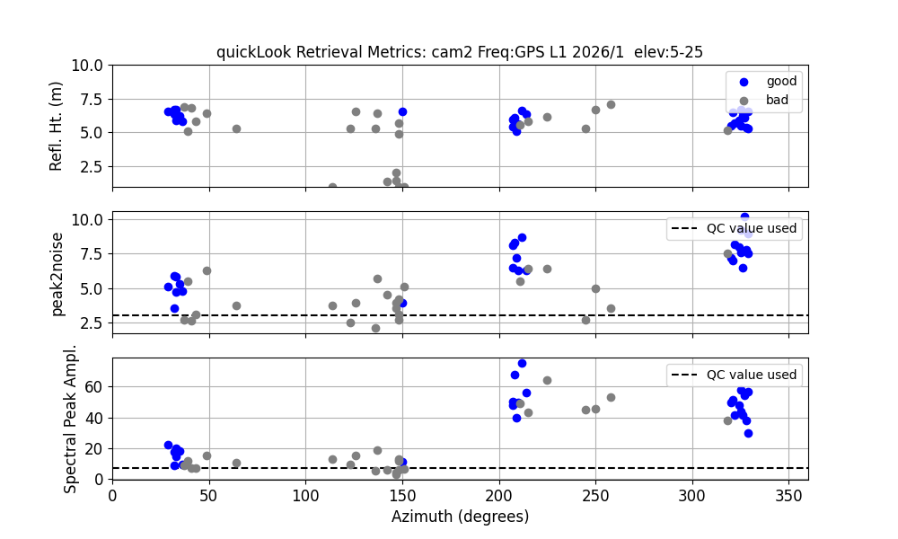
   
  <em>Figure 5. Comparison of <code>quickLook</code> retrieval metrics using default elevation masks of 5°–30° (left) and 7°–15° (right). The tighter elevation mask reduces noise and yields higher-quality reflector height retrievals.</em>

### 4. Define analysis inputs and processing strategy

Based on your finding from [<code>quickLook</code>](https://gnssrefl.readthedocs.io/en/latest/api/gnssrefl.quickLook_cl.html) and the quality control parameters you can now set most of input parameters using [gnssir_input](https://gnssrefl.readthedocs.io/en/latest/api/gnssrefl.gnssir_input.html) command. This module collects and saves all required parameters (such as station coordinates, frequency settings, elevation and azimuth constraints, refraction models, quality control thresholds) into a structured JSON file. The JSON file is saved in the directory <code>REFL_CODE/input/<site>.json</code>.

Key parameters to set:

The reflector height lower limit <code>-h1</code> and the upper limit <code>-h2</code>. Note that the default reflector height range is 0–8 m. For elevated installations, you should specify a custom range with `h1`and `h2`

Elevation <code>-e1</code> and <code>-e2</code> and azimuth <code>-azlist</code> mask. 

List of GNSS constellations and frequencies <code>-frlist</code>. We set to 1 101 201 corresponding to GPS, GLONASS, and Galileo L1 data, respectively. 

We can use the `extension` option to write results to `$REFL_CODE/year/results/site/extension`. This is useful for generating solutions with different processing strategies.

We use SNR files with extension `snr88` 

<code>gnssir_input cam2 -lat 2.9414362 -lon 9.9053138 -height 22.982 -h1 2 -h2 11 -frlist 1 101 201 -azlist 0 50 300 360 -e1 7 -e2 15 -extension 715_0360 -snr 88 </code>

### 5. Analyze data

Once an appropriate input parameters were set, reflector heights can be estimated using [gnssir](https://gnssrefl.readthedocs.io/en/latest/api/gnssrefl.gnssir_cl.html#module-gnssrefl.gnssir_cl) command:

Here, we process a single day, doy 1 of 2026, setting `plt` option to `True` to see the SNR data and periodograms and adding `extension` option:  

<code>gnssir cam2 2026 1 -plt T -extension 715_0360</code>

  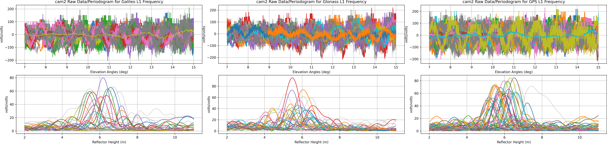
   
  <em>Figure 6. SNR data and corresponding periodograms for Galileo, GLONASS and GPS L1 frequencies (left to right). The dominant peaks around 5-7 m (change due to the tide) indicate consistent reflector height estimates across constellations.</em>

The daily analysis output files are stored in <code>$REFL_CODE/2026/results/cam2/715_0360/</code>

### 6. Processing and post-processing time series of reflector heights

We now process 3 months of data from doy 1 to doy 90 of 2026.

I maintain the daily archive of this RPR data at [the University of Bonn's cloud](https://uni-bonn.sciebo.de/s/QYTywsQeHbkRC62):

Download 2023 data and then store the NMEA files in <code>$REFL_CODE/nmea/cam2/2026/</code>
(password: LbPxiyJcf3).

Translate NMEA format to SNR format:

<code>nmea2snr cam2 2026 1 -doy_end 90 -lat 2.9414362 -lon 9.9053138  -height 22.982 -gzip True -snr 88</code> 

and process the data. Make sure you set the correct `extension` option. This time, make sure you do not use the `plt` option and if you want faster processing, use `-par` to speed it up.

<code>gnssir cam2 2026 1 -doy_end 60 -snr 88 -gzip True -extension 715_0360 -par 10</code>

We now have a time series of reflector heights in `REFL_CODE/2026/results/cam2/715_0360/`. The reflector height (not interprete it as water level) may vary due to tides, storm surges or flooding at coastal sites like `cam2`. Tidal variations shift the LSP periodogram (Figures 3, 4, and 6, note this the reflect daily changes caused by the tide). However, water level can also change a lot during a single satellite pass, e.g., within 20–60 minutes. These changes bias the estimated reflector height. This effect is often called **H-dot correction**, because standard GNSS-IR processing assumes that reflector height remains constant during a satellite arc.

The `subdaily` module is designed to handle this H-dot effect. In this module, a cubic spline is fitted to the reflector height time series and `h_dot` is estimated from it.

The `subdaily` module is the main post-processing tool for cases where sub-daily water-level variations are important such as tides, flooding and storm surges. It performs the following steps:

1. Filters outliers using standard deviation thresholds  
2. Applies the H-dot correction and spline fitting  
3. Removes inter-frequency biases  
4. Fits a final spline model to create an evenly sampled reflector height time series

`subdaily cam2 2026 -rhdot True -if_corr True -plt True -extension 715_0360`

This uses the default settings if you have not defined `subdaily` options in `gnssir_input`. The H-dot correction is applied by default. Reflector height estimates should be consistent across frequencies; large discrepancies may indicate hardware problems or environmental effects.....TBD

The first plot to examine is `$REFL_CODE/Files/cam2/715_0360/cam2_2026_combined.png` which shows the time series of reflector heights for all frequencies, together with azimuth, amplitude and peak2noise ratio.

  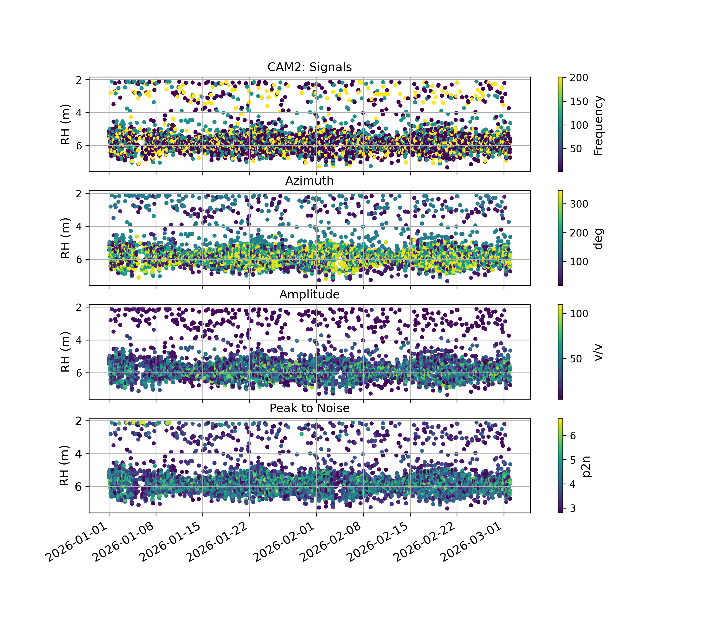
   
  <em>Figure 7. Time series of all reflector height as a function of azimuth, amplitude and peak2noise ratio</em>

The reflector height time series shows a clear main cluster around the true water level (~5–6 m), along with some scattered outliers. These inconsistent reflector heights are not real but are site-specific and in our case are likely caused by multipath from surrounding objects (land, structures, or vegetation) or unfavorable azimuth directions. To reduce these effects, we can use an azimuth mask either in the main processing strategy defined in `gnssir_input` or later during post-processing with the `subdaily` routine. So far, we have not used any azimuth mask. Most of the scattered reflector height (Figure 7) come from signals arriving from directions behind the antenna (0° < az < 170°) where there is land. Also, the antenna is tilted 90° sideways toward the water so it is not expected to receive useful signals from the back. So we now apply an azimuth mask in `subdaily`

`subdaily cam2 2026 -rhdot True -if_corr True -plt True -extension 715_0360 -azim1 170 -azim2 360`

  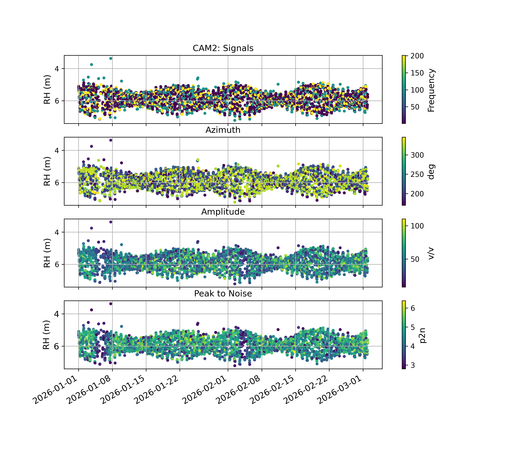
   
  <em>Figure 8. Time series of reflector heights for azimuth angles between 170° and 360° as a function of azimuth, amplitude and peak2noise ratio.</em>

Most of the scattered outliers are removed and a clear tidal signal can now be observed. 

Next plot is number of all reflector heights per constellation each day in `$REFL_CODE/Files/cam2/715_0360/cam2_2026_Subnvals.png`

  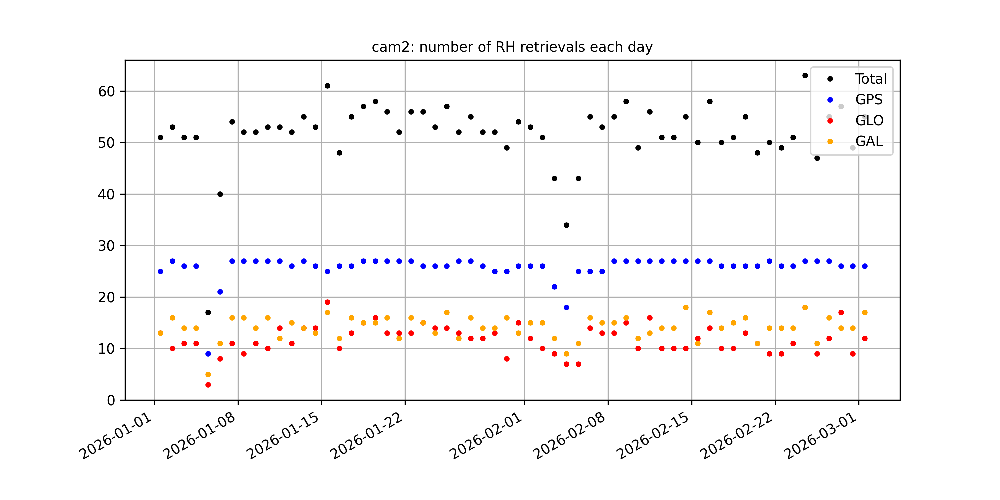
   
  <em>Figure 9. Number of reflector height retrievals per day separated by GNSS constellation (GPS, GLONASS and Galileo) and total counts. The plot shows relatively stable daily retrievals with GPS contributing the largest number of observations while GLONASS and Galileo provide additional coverage. Variations in total counts may reflect data quality, satellite geometry or filtering effects.</em>

#### Outlier removal:
The default option in `subdaily` is to exclude values that deviate by more than 2.5 standard deviations from the daily mean of reflector height. You can change the default by `-sigma` option. We can take a look at `$REFL_CODE/Files/cam2/715_0360/cam2_2026_outliers.png`

  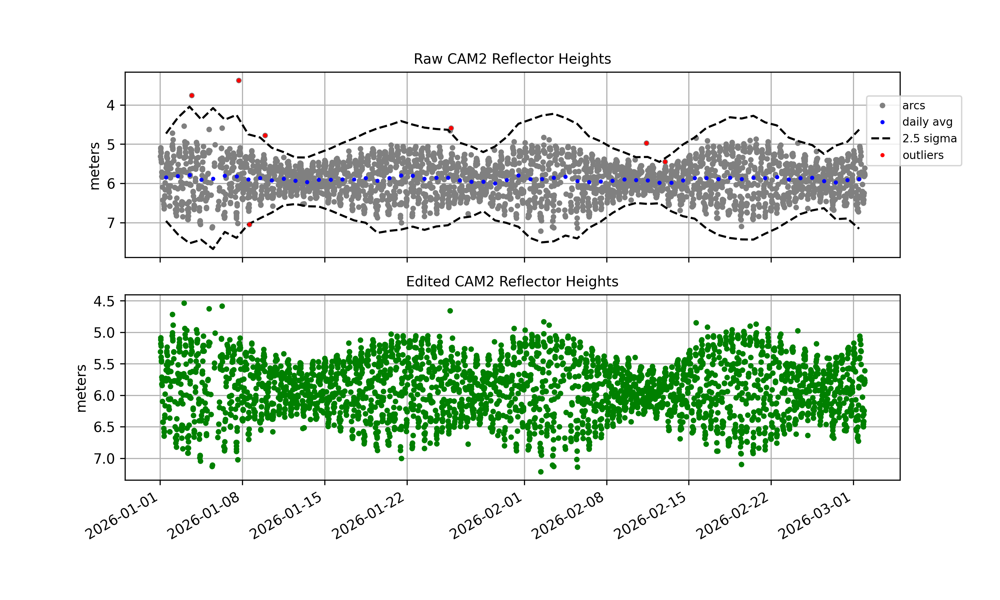
   
  <em>Figure 10. Comparison of raw and edited reflector height time series. The top panel shows the raw heights including outliers (red) and ±2.5σ thresholds (black dashed lines) and its daily average (blue). The bottom panel shows the cleaned time series after outlier removal. A clearer tidal signal and reduced scatter is visible.</em>

To see if azimuths systematically yield outliers, we can take a look at `$REFL_CODE/Files/cam2/715_0360/cam2_2026_outliers_wrt_az.png`

  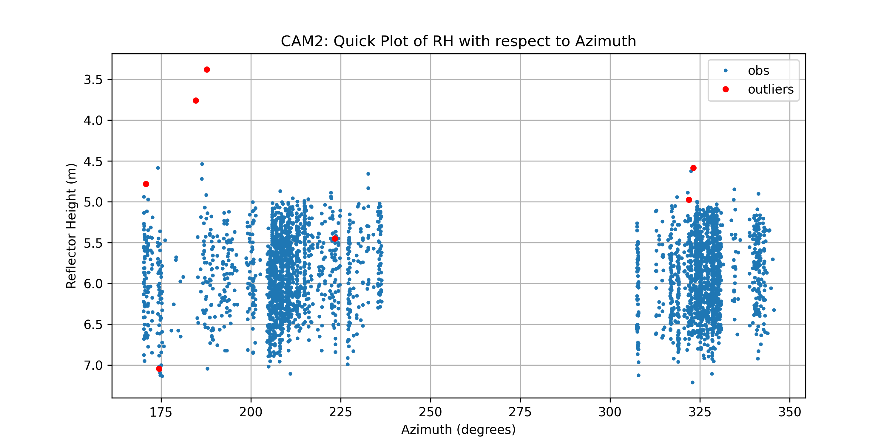
   
  <em>Figure 11. Reflector height as a function of azimuth after applying azimuth filtering (170°–360°). Most outliers are removed and consistent reflector height estimates are observed, with clearer clustering in azimuth sectors facing the water. This highlights the importance of excluding back-azimuth directions affected by land and antenna orientation.</em>

An initial cubic spline is fitted to all “cleaned” reflector heights and then H_dot correction is calculated using that spline in `$REFL_CODE/Files/cam2/715_0360/cam2_rhdot2.png`. The reflector height with and without H_dot correction are compared in terms of RMS values and their plots. Three sigma criteria is used to remove outliers (differences between corrected reflector height the and spline fit).

  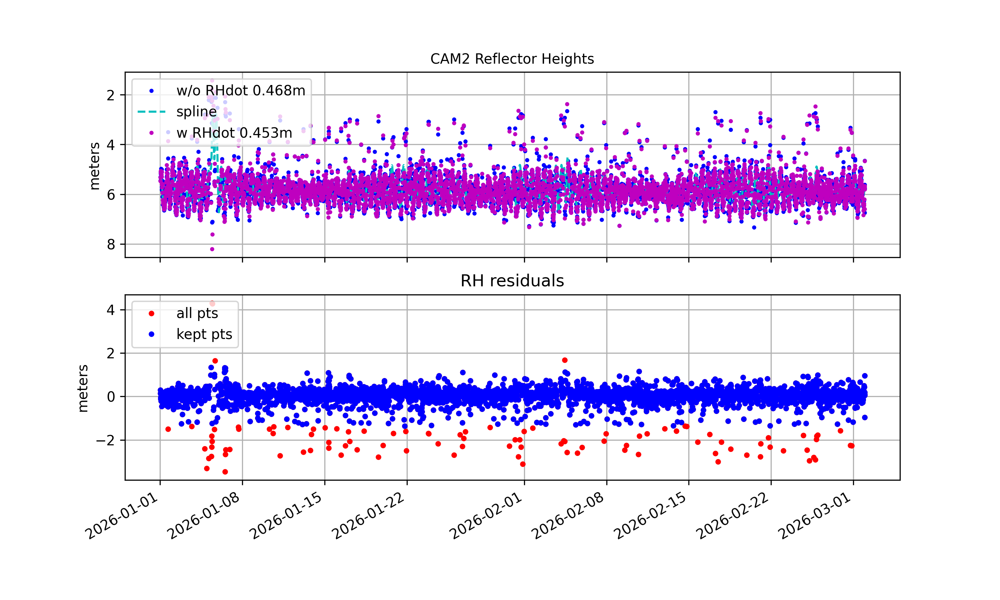
   
  <em>Figure 12. Reflector height time series after applying H-dot correction and spline fitting. The top panel compares reflector heights with and without H-dot correction and the fitted spline model. The bottom panel shows residuals where outliers (red) are removed. This leaves a cleaner and more consistent set of observations (blue).</em>

We can control spline fit with `–knots` option. The defauls is ...

We can also use `-spline_outlier1` option in meter for using different values rather than 3 sigma criteria for outlier removal.

How big H-dot correction is?

H-dot correction values are plotted in `$REFL_CODE/Files/cam2/715_0360/cam2_rhdot3.png`

  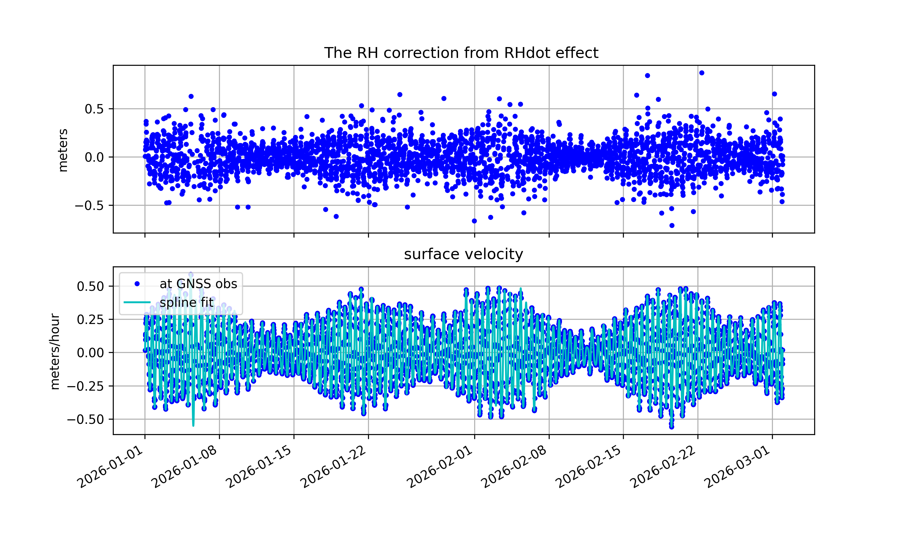
   
  <em>Figure 13. Reflector height correction due to the H-dot effect. The top panel shows the magnitude of the H-dot correction applied to the reflector heights, generally centered around zero with some variability during periods of rapid water-level change. The bottom panel shows the estimated surface velocity (h_dot) and its the spline fit. That highlights sub-daily variations by tidal dynamics.</em>

These plots show the results of the first spline fit. A new spline is then fitted to the corrected reflector height time series. The reflector height retrievals from GPS L1 are used as the reference and any offsets in reflector height from the other frequencies are adjusted accordingly. Outliers are then removed again using a three-sigma criterion. The plot is `$REFL_CODE/Files/cam2/715_0360/cam2_rhdot4.png`

  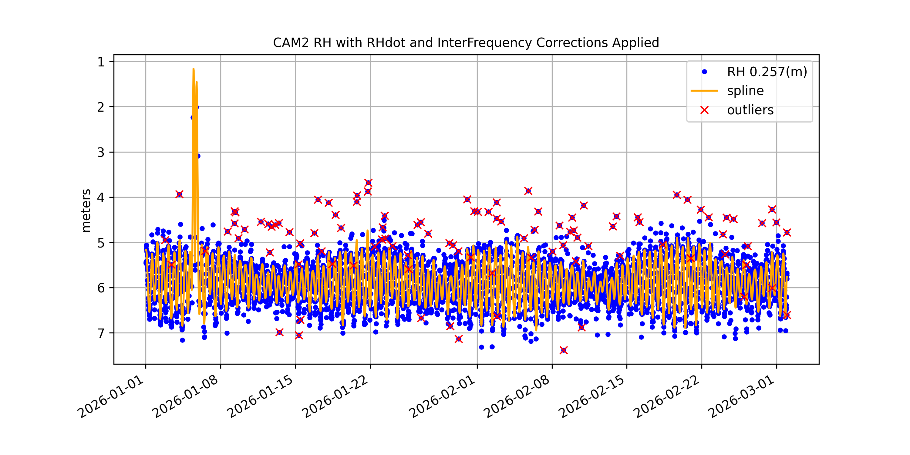
   
  <em>Figure 14. Final reflector height time series after applying H-dot and inter-frequency bias corrections. The cleaned observations (blue) show a consistent tidal signal, while the spline fit (orange) captures the smooth sub-daily variations. Remaining outliers (red) are identified and excluded from the final solution.</em>

We can control secondary spline fit with `–knots2` option. The defauls is ...

We can also use `-spline_outlier2` option in meter for using different values rather than 3 sigma criteria for outlier removal.

The secondary spline can be evenly resampled by a user defined interval (e.g. 30 mins , 1 hour, etc) and define the orthometric height time series (plt in `$REFL_CODE/Files/cam2/715_0360/cam2_H0.png`). Noe that these values do not represent actual water levels (could be nonphysical hight variations). The spline fit is affected by data gaps and the chosen time intervals, so it should “not” be used for tidal harmonic analysis.

  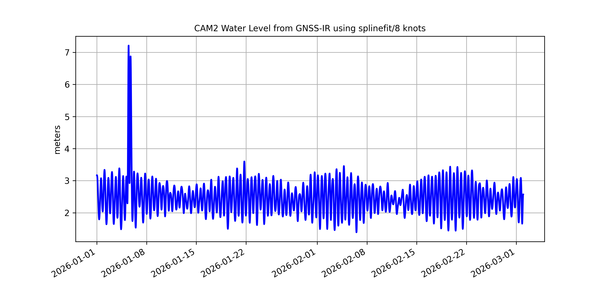
   
  <em>Figure 15. Final GNSS-IR derived water level time series after applying H-dot and inter-frequency corrections along with spline fitting (8 knots). The time series clearly shows the tidal signal, with smooth sub-daily variations captured by the spline model. A short spike is visible, likely caused by remaining outliers or data gaps.</em>

Prepared by [Makan Karegar](https://github.com/MakanAKaregar). Last updated April 10, 2026.
